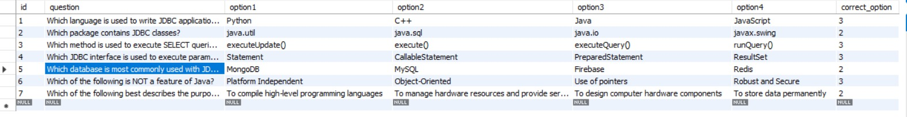
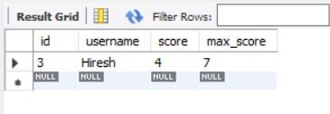

# Online Quiz System (JSP + Servlets + MySQL)

An **Online Quiz Application** built using **JSP, Servlets, JDBC, and MySQL**.  
The system supports **Teacher and Student roles**, allowing teachers to add questions and students to attempt quizzes with automatic scoring.

---

## 🚀 Features

### 👨‍🏫 Teacher
- Add new quiz questions
- Define multiple options
- Set correct answer
- Try the quiz

### 👨‍🎓 Student
- Enter username
- Attempt quiz
- Get instant score
- View correct answers for wrong questions

### ⚙ System
- Automatic score calculation
- Results stored in MySQL database
- Clean and simple UI
- Role-based navigation

---

## 🛠 Tech Stack

- **Frontend:** JSP, HTML, CSS  
- **Backend:** Java Servlets, JDBC  
- **Database:** MySQL  
- **Server:** Apache Tomcat  
- **IDE:** Eclipse  

---

## 🗄 Database Structure

### Questions Table

### Results Table

